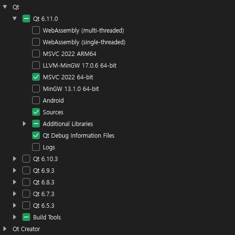
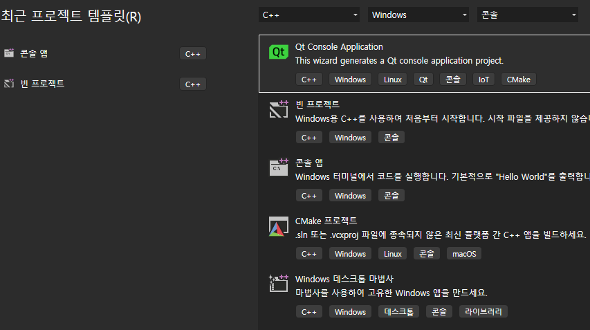
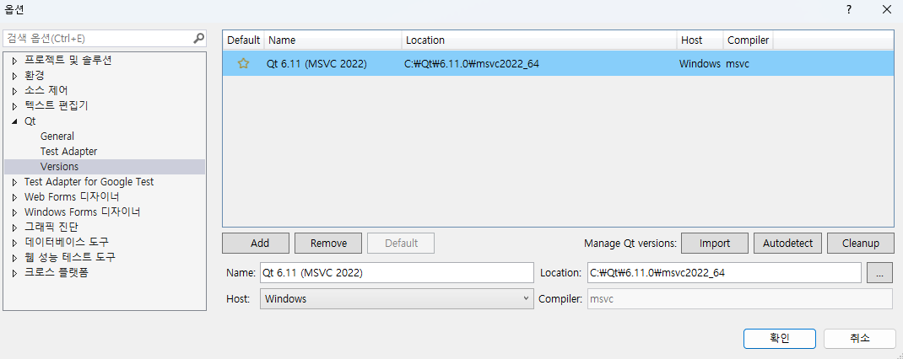
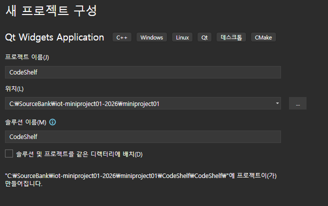
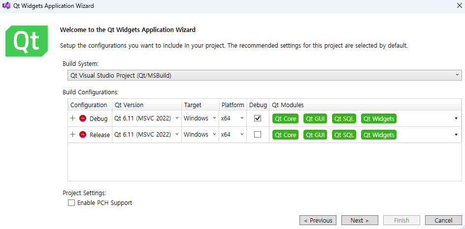
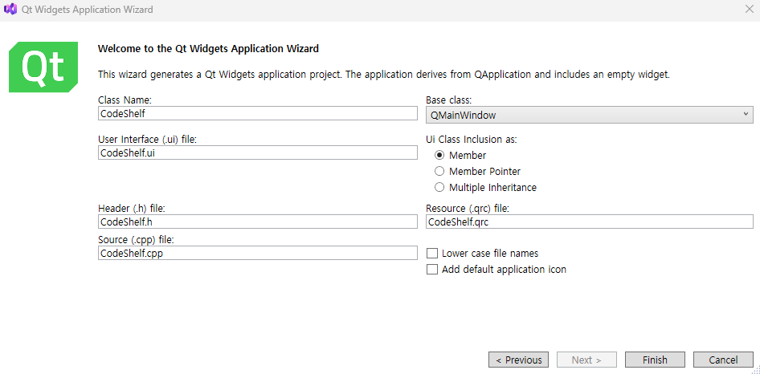
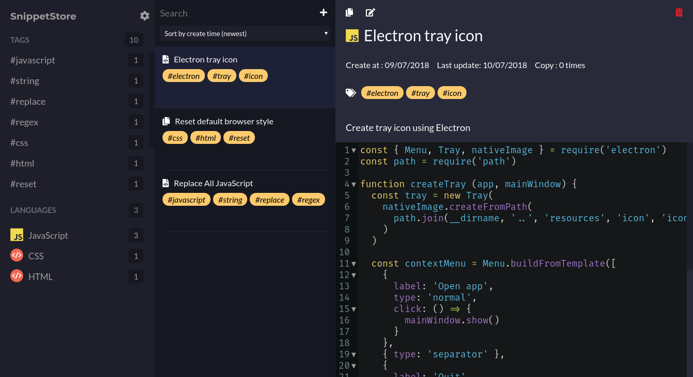

qt
https://www.qt.io/development/download-qt-installer-oss 링크
설치 부분

확장 프로그램도 설치
설치후 재시작

확장 >qtvstool >  qtversion

vs에서

- qt sql 추가

## 미니 프로젝트 제안서
1. 프로젝트 개요
- 프로젝트명 : 창고 관리 시스템
- 기간 : 
- 팀 구성 : 
- 목적 : 

2. 개발 배경
- 현재 문제 상황 : 
- 기존 방식의 한계 : 
- 개발 필요성 : 

3. 핵심 기능
- 기능 1 : 기초 정보 관리(Master Data)
- 기능 2 : 핵심 물류 프로세스(Core Process)
- 기능 3 : 조회 및 모니터링(Visibility)

4. 기술 스택
- frontend : Qt
- backend : C/C++
- database : MySQL
- 기타 : 

5. 기대 효과
- 사용자 측면 : 
- 기술적 성과 : 
- 활용 가능성 : 

6. 개발 일정
- 1주차: 기획 및 설계
- 2주차: 개발
- 3주차: 테스트
- 4주차: 보완 및 발표

7. 역할 분담

8. 리스크 및 대응

1. 기초 정보 관리(Master Data)
- 상품 등록 / 수정 / 삭제
- 창고위치관리(물건의 위치정보)
- 거래처 관리(공급처 정보)

2. 핵심 물류 프로세스(Core Process)
- 입고(Stock-In) : 
- 출고(Stock-Out) : 
- 재고 조정(Adjustment) : 

3. 조회 및 모니터링(Visibility)
- 실시간 재고 현황판 : 현재 창고에 뭐가 얼마나 남았는지(Table)
- 입출고 이력(Log) 조회 : 누가 언제 어떤 상품을
- 적정 재고 알림 : 재고 < 설정한 최소 수량 일때 빨간색으로 띄우기

# 1일차
## step 1 : 메인화면
### UI 위젯 배치(Layout)
1. 상단
- 상단 바
    - 로고
    - 홈/검색 토글
    - 유저(로그인)
2-1 메인화면(코드)
- 왼쪽
    - 카테고리(태그)
- 센터
    - 검색
    - 아이템(파일)
        - 아이콘
        - 파일명
        - 날짜
        - 태그
- 오른쪽
    - 파일 설명
        - 파일명
        - 언어
        - 설명 등
    - 파일 내용
        - 코드 내용
2-2 메인화면(대시보드)
- 추후 구현

### Center 아이템 추가 기능

