# iot-python-2026
IoT 개발자 파이썬 리포지토리

## 1일차

사전 C/C++ 학습완료. 프로그래밍 문법 파악 중

**기본 문법 리스트**
- 변수, 데이터형
- 연산자
- 제어문
    - 조건문
    - 반복문
- 함수/메서드
- 배열 개념
- 포인터/참조 개념 - 포인터없음
- 구조체 - 구조체 없음
- 객체지향 클래스
- 파일 입출력
- 예외처리

다른 언어는 새로 다시 공부해야 한다기보다 필요한것만 보충 학습

### 이론적 개념 정리

#### 파이썬에 신경 안써도 되는 것
- 학습 난이도를 낮추는 목록
    - 자료형 선언 안 함
    - 세미콜론 없음(옵션으로 사용 가능)
    - 중괄호 없음 - `들여쓰기를 신중히`
    - `main()` 강제 아님 - 비슷한 기능은 있음
    - 메모리 할당/해제 거의 하지않음
    - 헤더 파일 개념 없음
    - 컴파일 과정 거의 신경 안씀
    - 개발환경 설정 어렵지 않음

- 문법 비교표
    | 이론기념 | C/C++ | Python |
    | -- | -- | -- |
    | 출력 | printf(), cout | `print` |
    | 변수 선언 | int a = 10; | `a = 10` |
    | 조건문 | if(a > b) { ... } | `if a > b` |
    | 반복문 | for(int i = 0 ; i < 10; i++ {} | `for i in range(10):` |
    | 함수 | int add(int a, int b) {} |` def add(a,b):` |
    | 배열 | int arr[5] | `list` |
    | 문자 | char, char[], char*, string | `str` |

- 장점
    - 들여쓰기가 코드 블록, {} 불필요
    - 선언이 없음
    - 리스트가 배열보다 훨씬 편하고 간결
    - 문자열 처리 간단
    - 함수 만들기 간단

- 단점
    - 상대적으로 실행속도가 느림(실행파일X)
        - 일부 처리되는 부분은 빠름
    - 들여쓰기 문제 가능성(공백 하나로도 문법 오류)
    - 파일명 지정 시 클래스명과 동일하게 사용하면 문제발생
    - 디버그 콘솔이 여러개 실행 가능(하나만 실행되도록 정리)

    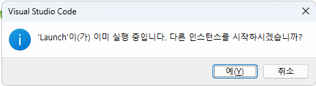

    


### 파이썬 설치

- https://www.python.org - 다운로드
    - 최신버전 설치 지양. 3.12 버전
    - ~~Python install manager 클릭~~
    
    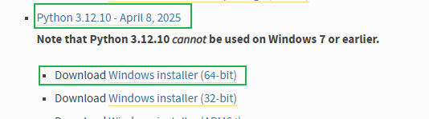

    - 3.12 페이지 검색, Windows Installer (64-bit) 클릭

- 설치
    - 아래와 같이 설치
    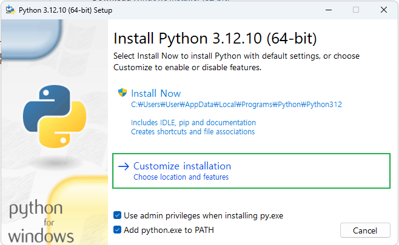

    - 다음에서 Documentation 만 체크 해제
    - Advanced Options에서 Install Python 3.12 for all users 활성화
    - Install 시작
    - 설치 후

    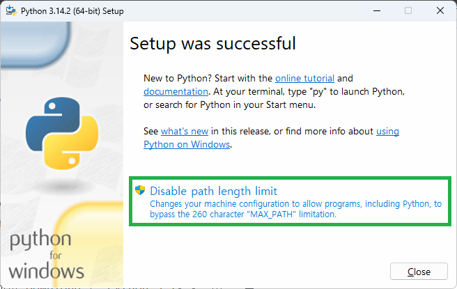

    - 윈도우 디렉토리 Path 길이 260자 제한되어 있음. Linux/MacOS 등과 호환시 문제 발생

    - 콘솔에서 확인 안되면 시스템속성(sysdm.cpl) 에서 Path 확인할 것

    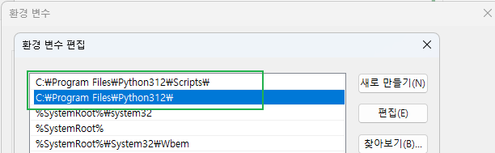

### VS코드 확장
- 확장
    - Python 검색 후 설치

    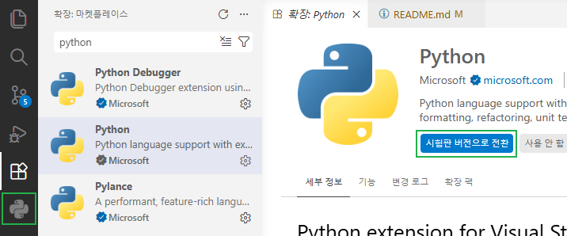

    - Jupyter 검색

    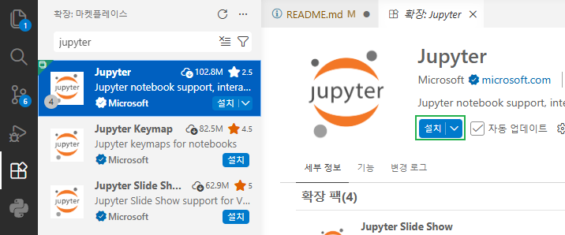

### 깃허브 확장
- 웹 코딩 환경
    - https://github.`com` - > `.dev` 변경 후 실행 
    - Visual Studio Code와 동일한 화면으로 변경
    - 주피터 노트북으로 데이터분석 등을 깃허브에서 바로 개발할 때 활용
    - Google Colab과 동일

    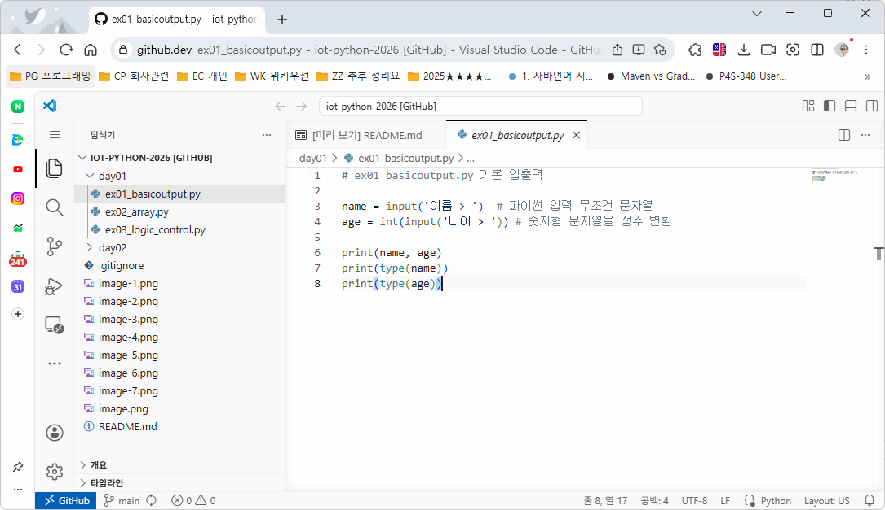

### 파이썬 기본 학습

1. 기본 입출력 - [소스](./day01/ex01_basicoutput.py)
    - .py 파일 작성
    - Ctrl + F5 실행
    - 디버거 선택 > `Python Debugger` 선택
    
2. 리스트(배열 대체) - [소스](./day01/ex02_array.py)
    - 어떤 데이터타입도 추가 가능
    - append ~ sort 까지 11개 함수만 학습

3. 제어문 - [소스](./day01/ex03_logic_control.py)
    - if, for, while
    - switch~case문 없음

## 2일차

### 파이썬 기본 학습

4. 변수, 자료형 - [소스](./day02/ex04_variable.py)
    - 선언이 없고, 자료형을 지정하지 않음
    - 자료형 자체를 사용안함, 형변환 필요
    - 기본자료형, int, float, str, bool, NoneType(NULL과 거의 같은 기능)

5. 연산자 - [소스](./day02/ex05_operator.py)
    - 사칙연산, 할당연산, 비교연산, 논리연산, 멤버십연산 
    - 연산자 우선순위 : 거듭제곱 > 곱셈, 나눗셈 > 덧셈, 뺄셈, ()로 연산자 우선순위 설정

6. 문자열 - [소스](./day02/ex06_string.py)
    - C방식 문자열 처리가능
    - 여러 문자열 출력방식 존재, f-string 사용 추천
    - 포맷팅 기법

7. 함수 - [소스](./day02/ex07_function.py)
    - 객체지향언어 함수 -> 메서드(Method)로 호칭(C#, Java, ...))
    - 파이썬도 함수(Function)로 호칭
    - C와 유사하게 함수 사용 전에 선언
    - def로 선언 파라미터 괄호 뒤 : 사용

8. 파일 입출력 - [소스](./day02/ex08_fileio.py)
    - C/C++과 모드가 동일 r, w, a
    - with 구문으로 close() 생략 가능
    - 쓰기 각 문장끝 `\n` 추가
    - 기본적으로 UTF-8
    - CSV, JSON, 텍스트파일 등 읽기에 많이 사용

9. 여기까지 배우고 활용하는 분야도 존재
    - 데이터 분석, 머신/딥러닝, ...

10. 연습
    - 구구단 - [소스](./day02/pr01_gugudan.py)
    - 자판기 - [소스](./day02/pr02_vending.py)

11. 라이브러리 사용 - [소스](./day02/ex10_builtin_lib.py)
    - 파이썬 표준 라이브러리 - 파이썬에 포함된 기본 라이브러리
    - 외부 라이브러리 - pip로 설치하는 3rd-party에서 개발된 라이브러리
    - C/C++ `include` -> Python `import`
    - import : 모듈과 클래스를 모두 기재
    - from ~ import ~ : 클래스명만 기재
    - 라이브러레(모듈).클래스.함수() 형태로 존재

## 3일차

### 파이썬 기본 학십

11. 라이브러리 사용 계속 - [소스](./day03/ex11_out_pakage.py)
    - 타언어의 경우 웹 검색, 다운로드, 개발위치 설치나 복사
    > 매우 불편
    - CPU 아키텍처에 따라 32bit(x86), 64bit(x64) 마다 설치 방법 상이
    - 파이썬은 자신만의 패키지 관리자(Pakage Manager : pip) 사용
    - 웹 검색(https://pypi.org/) 후 pip 명령어로 각 파이썬 개발환경에 맞춰 설치
    - 패키지 > 라이브러리 > 모듈

    ```bash
    > python --version
    Python 3.12.10
    > pip --version
    pip 25.0.1 from C:\Program Files\Python312\Lib\site-packages\pip (python 3.12)
    > pip install requests
    ...
    Successfully installed .. requests-2.33.0

    > pip list
    Package Version
    ------- -------
    numpy   2.4.4
    pip     25.0.1

    > pip uninstall 패키지명

    ```
    - CSV 라이브러리 - [소스](./day03/ex12_csv_pakage.py)

12. 기타자료구조 - [소스](./day03/ex13_datastruct.py)
    - 리스트 외 튜플, 딕셔너리, 셋 등 ...
    - 각 자료구조 형태를 구분

13. main - [소스](./day03/ex14_main.py)
    - 파이썬은 main함수가 필요없음
    - 여러 파일 중 시작점(Entry point)을 지칭할 때 사용
    - `__main__` 특수변수를 사용
    
14. 가상환경(Virtual Environment)
    - 프로젝트 마다 파이썬 환경을 따로 사용하기 위해 만들어진 개념
    - 프로젝트 생성 시 독립된 파이썬, 라이브러리 세트 새로 생성
    - 실제환경 C:\Program Files\Python312 와 비교
    - 일반적으로 프로젝트 폴더에서 생성

    ```bash
    > python -m venv iot-venv(가상환경이름)
    ```

    - 가상환경 생성 후 가상환경 활성화 필수
        - Set-ExecutionPolicy -ExecutionPolicy RemoteSigned

        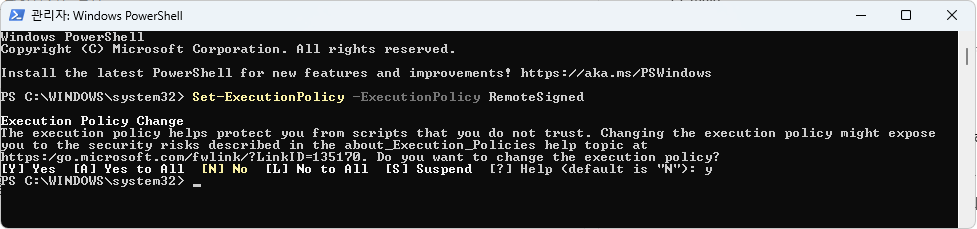

    ```bash
    > iot-venv\Scripts\Activate.ps1 
    ```

    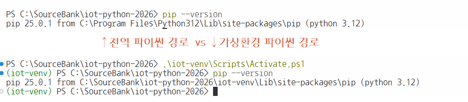

    - 가상환경은 github에 올리지 말 것. `.gitignore`에 가상환경 폴더명 추가

15. 객체지향 - [소스](./day03/ex15_oop.py) ~ [소스](./day03/ex18_encapsule.py)
    - C++의 객체지향, 클래스와 동일
    - 접근제한자가 없음(public, privated, protected)
        - 개발자가 알아서 해라
    - C++과 달리 new를 사용하지 않음, 변수 등 제약사항이 많이 없음
    - 클래스 내의 모든 함수의 첫 번째 파라미터는 `self`로 시작, C++의 this와 기능적 동일(사용방법은 다름)
    - 호출시에는 self 사용X
    - 파이썬의 철학 : `막지 말고, 알아서 지켜라`
    - public, private(`__`로 변수선언), protected(`_` 변수 선언) C++처럼 접근 제한자를 많이 사용하지 않음

16. 예외처리 - [소스](./day03/ex19_exception.py)
    - 비정상 종료를 막는 기능
    - try ~ except ~ finally 로 구분지어 사용(else는 잘 사용안함)
    - except를 여러번 쓸 수 있으나, except Exception as e 하나로 통일해도 무방
    - 예외처리가 발생하면 처리 속도가 늦어짐. 비정상종료를 막기위한 부분

### 파일 입출력
- 인코딩
    - EUC- KR : 2바이트 한글 완성형 인코딩. CP949 동일한 의미
    - UTF-8 : 1바이트 영문(ASCII호환), 3바이트 한글, 4바이트 이모지 등 최대 4바이트 사용
    - 대한민국 데이터 포털에서 제공하는 CSV는 EUC-KR 사용중, UTF-8 변환필요
- CSV
    - 엑셀과 호환가능한 텍스트 파일
    - 텍스트 양이 많으면 한번에 일을 수 없음. 한줄씩 나눠서 읽어야 함
    - 보통 csv 라이브러리 사용

- JSON
    - JavaScript Object Notation : 자바스크립트에서 데이터를 사용하기 위해 만든 표기방법
    - 딕셔너리를 텍스트화
    - 데이터를 네트워크로 전달할 때 가장 효율적인 파일형식
    - XML을 대체하는 기술
    - 저장된 json 파일을 사용 또는 OpenAPI 네트워크로 전달된 데이터를 사용

### 주피터 노트북
- 주피터 노트북
    - 파이썬을 좀 더 인터랙티브하게 사용하고자 하는 취지
    - 논문처럼 글과 소스 실행을 병행
    - Project Jupyter
    - 확장에서 Jupyter 설치

- 사용법 - [노트북](./day03/ex20_jupyter_start.ipynb)
    - 명령 팔레트(Ctrl + Shift + P)

    

    - Untitled-1.ipynb 파일 생성. 파일 저장 우선
    - 커널 선택 클릭
    - 마크다운셸(일반적 설명글), 코드셸(소스코드 작성)로 구분
    
    

    - 최초 한번만 팝업

- 주피터 노트북 단축키
    - a : [선택모드] 현재 셸 위에 코드셸 추가
    - b : [선택모드] 현재 셸 아래에 코드셸 추가
    - enter : [선택모드] 현제 셸 편집모드로 진입(커서 깜빡임 확인)
    - ctrl + enter : [편집모드] 마크다운셸 - 빠져나오기, 코드셸 - 실행
    - alt + 위아래 방향키 : [선택모드] 셸 위치 변경
    - l : [선택모드] 라인번호 토글
    - dd : [선택모드] 셀 삭제
    - c : [선택모드] 셸 복사
    - v : [선택모드] 셸 붙여넣기
    
- 사용처
    - 웹상에서 동작하므로 많은 서비스를 지원
    - [Github Codespace](https://github.com/features/codespaces?locale=ko-kr) - 기존 리포지토리와의 연결 지원(무료일 경우 한달 140시간)
    - [Google Colab](https://colab.research.google.com/) - 구글에서 지원하는 노트북서비스, 구글 드라이브와 연결, 90분 연결무료, 기능 제약적

### 데이터 분석 기초 - [소스](./day03/ex21_dataprocess.ipynb)

- ~~리스트, 튜플, 딕셔너리~~
- 리스트 컴프리헨션
- 파일 입출력
- Numpy

## 4일차

### 데이터 분석 기초

- 분석용 기초 이론 계속
    - NumPy
    - Pandas - [노트북](./day04/ex22_dataprocess.ipynb)
    - Matplotlib
    - Seaborn - [노트북](./day04/ex23_dataprocess.ipynb)
    - Folium - [노트북](./day04/ex24_map_vis.ipynb)
    - wordCloud - [노트북](./day04/ex25_wordcloud.ipynb)
    - [기초 통계](#기초-통계)
    - [데이터 전처리](#데이터-전처리)

- 데이터분석
    - 인사이트(Insight) : 특정한 맥락 속에서 특정 원인이나 효과를 이해하는 것
    - 방대한 데이터 속에서 패턴이나 인사이트(통찰)을 도출, `합리적인 의사결정`, `고객 행동 예측`, `운영 효율화`, 신규 비즈니스 기회 창둘 등을 하는 핵심 도구
    - 데이터 기반의 의사결정 가능
    - 고객 이해도 증가
    - 운영 효율성 및 비용 절감
    - 트렌트 파악 및 경쟁력 강화
    - 미래 예측

#### 기초 통계
- 기초통계
    - `평균(Mean)` - 전체 합계를 수로 나눈 것
    - `중앙값(Median, 50%)` - 평균과 달리 전체 데이터의 중앙을 나타내는 값
    - 최빈값(Mode) - 가장 많이 나온값. WordCloud에서 가장 많이 나온 값을 크게 표시
    - 분산(Variance) - 데이터가 얼마나 퍼져있는지. 평균으로 부터의 거리 평균
    - 표준편차(Standard Deviation) - 분산의 제곱근. 데이터의 흩어짐 정도를 산출
    - 최소값(Min)/최대값(Max) - 범위 파악
    - 사분위수(Quartile) - 데이터를 4등분. Q1(25%), Q2(50% median), Q3(75%)
    - `상관계수(Correlation)` - 두 데이터의 관계. 1(강한 양의 관계), 0(관계없음), -1(반대관계). 산점도
    - 정규분포(Nomal Distribution) - 현재의 값이 정상범위인지 판단할 때, 퍼진 정도를 그래프로, 종모양
    - `이상치(Outlier)` - 튀는 값

#### 데이터 전처리
- 데이터 전처리
    - 분석/모델 처리 전에 데이터를 정리하는 과정
        - 전체 데이터분석의 시간 60~80%까지 전처리에 사용
        - 도메인(특정 비즈니스)에 따라 이해도
        - 수정하고 틀리면 또 수정
    - 현실 데이터의 문제
        - 데이터 구조가 제각각(json, csv, db, ...)
        - 값이 비어 있음(결측치)
        - 이상한 값이 있음(이상치)
        - 숫자와 문자가 뒤섞임
        - 위와 같은 데이터를 분석이나 머신러닝/딥러닝에 넣으면 처리가 엉망이 됨
    - 전처리 핵심 4단계
        - 결측치 처리
        - 이상치 처리
        - 스케일링
        - 인코딩
    - 결측치 
        - 전체 데이터(해당컬럼)에서 10% 정도의 결측치가 있으면 다른 값(평균, 최소, 최대, 중앙값...)으로 채워넣음
        - 40% 이상의 결측치를 가지면, 이 컬럼은 삭제(분석에서 제외)
    - 이상치
        - 단순 제거
        - 4분위수를 사용, 통계 기반으로 제거
    - 스케일링
        - 값의 범위를 맞추는 것
        - 표준화, 정규화
    - 인코딩
        - 문자를 숫자로 변환
        - 예. male, female은 분석불가 -> 0, 1(수, 분포... ) 수치적인 통계 가능
        - One-Hot Encoding, male[1, 0, 0], female[0, 1, 0], child[0, 0, 1]

## 5일차

### 영상처리

- 개요
    - Image processing
    - 이미지를 컴퓨터 분석하고 변환하는 분야
    - 동영상 : 연속된 이미지 + 음성
    - 음성 제외 연속 영상만 사용
    - 초당 이미지를 여러개 변경해서 만들어지는 것 : 보통 1초에 30개 이미지가 변경
    - Frame : 동영상에서 하나씩 변경되는 이미지
    - FPS : Frame Per Second. 1초에 뿌려지는 이미지 수
    - 영상처리는 이미지, 동영상 모두 분석하고 변환처리하는 것
    - 컴퓨터 비전(Computer Vision) - 영상처리를 컴퓨터로 처리

- OpenCV
    - 오픈 소스 컴퓨터 비전 라이브러리
    - 독립적 OS 플랫폼에서 사용가능
    - C로 개발 C++로 변경
    - 모든 언어에서 사용할 수 있도록 래핑 라이브러리가 존재

- OpenCV Python - [노트북](./day05/ex26_opencv.ipynb)
    - OpenCV를 파이썬에서 사용하도록 만든 래핑 라이브러리
    - 코드 간결, AI/딥러닝과 연결 쉬움, 데이터 분석 통합 가능
    - C++ OpenCV보다 속도가 느림
    
- VLC
    - 영상처리 쪽 코덱 필요
    - https://www.videolan.org/vlc/index.ko.html
    - https://livecodec.co.kr/web/guide.html

- OpenCV 간단 이미지에디터 - [소스](./day05/ex27_cv_editor.py)
    - 대비/밝기, 블러, 엣지, 회전, 이진화
    - 실행화면
    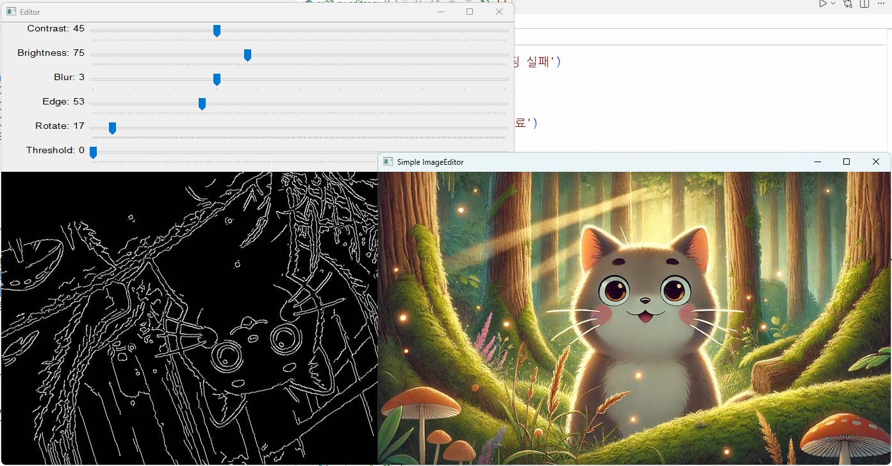

## 6일차

### 실시간 웹캠 처리

- 기본 웹캠 실행
- FPS(초당 프레임 수) 출력
- 스냅샷 이미지 저장
- 얼굴 검출 및 모자이크 처리
- 

## 7일차


### 가상환경 실행
- 생성한 가상환경 내에 Scripts 폴더 안, Activate.ps1 실행해야 가상환경 준비


```powershell
# 가상환경 활성화(진입)
> .\iot-venv\Scripts\Activate.ps1

# 가상환경 비활성화 - 파워쉘 종료
```
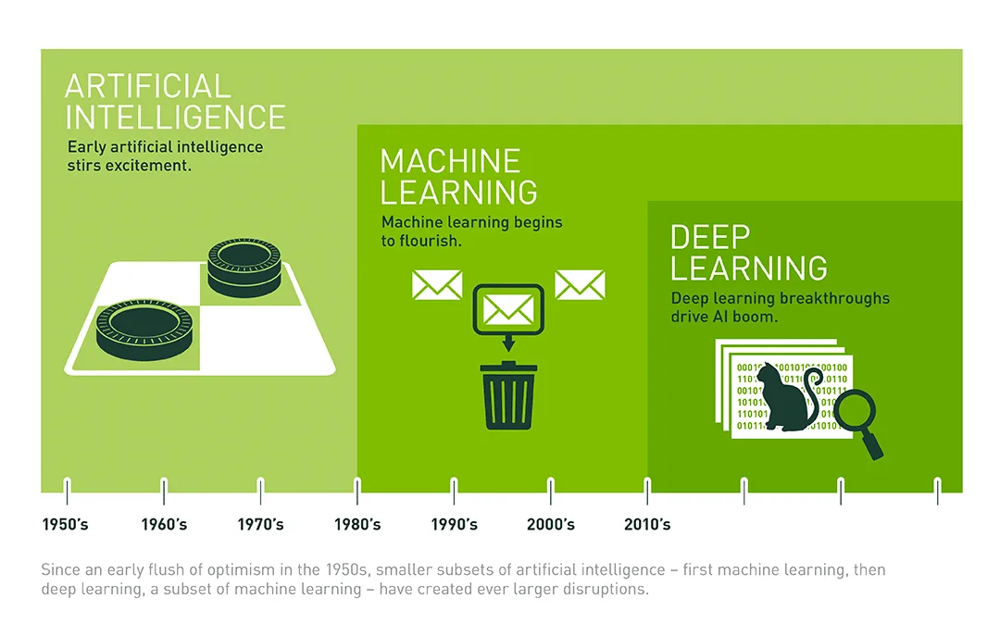

### 머신러닝, 딥러닝
- Machine Learning - 데이터로 규칙을 컴퓨터가 스스로 찾아내는 알고리즘
- Deep Learning - 인간과 유사한 인공 신경망으로 패턴을 학습, 음성인식, 번여그 자율주행, 이미지 생성 등 다양한 분야에서 사용되는 머신러닝의 한 갈래

#### 이전 프로그래밍과 딥러닝의 차이

- 이전 : 2, 4(데이터 입력) 해서 6이 나오는 계산기를 코딩
- 딥러닝 : 2, 4 -> 6, 7, 8 -> 15(입력, 출력 데이터 제공), 계산기를 개발해줘!

#### 딥러닝
- 컴퓨터가 스스로 학습해서 패턴을 찾아내는 기술

#### 딥러닝이 발전한 이유
- 빅데이터화, 하드웨어 발전, 알고리즘 개발

### 딥러닝 학습

#### 딥러닝 프레임워크 종류

- **PyToch** : 가장 인기가 많은 딥러닝 FW. 연구, AI서비스, LLM, YOLO...
- TensorFlow : 구글이 개발, 산업용 TPU(칩 생산)
- Keras : 교육용 인기
- etc : 몰라도 됨

 ### 파이토치

 - 코드가 직관적이고, 디버깅이쉽고, 연구/개발쪽 모두 선호하는 프레임웤

- 설치방법

    - GPU버전 : 컴퓨터 CPU를 사용해서 연산하는 방법
        - 간단 설치

    - GPU버전 : 컴퓨터 그래픽카드의 CPU를 사용하는 방법
        - Nvidia 그래픽카드의 경우 CUDA 프레임워크 설치되어야 함(필수X)
            - OpenCV의 경우 CUDA 설치 필수
        - 내부에 CUDA 런타임 라이브러리를 가지고 있음
        - pip3 install torch torchvision --index-url https://download.pytorch.org/whl/cu126
        - cu126-cp312-cp312-win_adlm64.whl 대력 2.6GB 정도


 ####  파이토치 기본문법
 - [소스](./day07/ex29_pytorch_basic.ipynb)

#### 선형회귀(Linear Regression)
- 데이터의 경향이 직선으로 나타나는 모델
- 한 개 이상의 독립변수와 종속변수 사이의 선형관계를 모델링하는 통계기법

- 예 : 공부시간에 따른 시험 점수를 예측
    - 공부 시간(독립변수/입력값) : x
    - 시험 점수(종속변수/출력값): y
    - y = wx + b 직선의 방정식을 찾는 것

    - 공부시간과 시험점수 사이의 관계를 찾을 것
    - 기울기 w : 공부시간이 1시간 늘면 점수가 몇점 오르나?
        - w = 10 -> 1시간 공부하면 10점 오른다
    - 절편 b : 기본점수, 공부를 하나도 안해도 나오는 점수
        - b = 45 -> 찍어도 나오는 점수
    
    - 가장 잘 맞는 w와 b를 찾아가는 과정

    - 선형회귀 순서
        1. 임의 w와 b를 지정
        2. 독립변수(입력값)에 대한 종속변수(실제값)과 예측값 도출
        3. 둘 사시의 오차를 계산 -> 손실함수
        4. 미분계산 -> 역전파
        5. w와 b를 약간 수정 -> 경사하강법
        6. 반복 -> 학습률

#### 정리

- 일반 프로그래밍 : 입력값, 가중치, 절편을 입력해서, 출력값을 리턴하는 프로그램 개발
- 인공지능 프로그래밍 : 입력값, 출력값을 입력해서, 가중치, 절편 등을 구하는 모델을 개발


#### 퍼셉트론

- 다수의 신호를 입력받아 하나의 신호로 출력하는 모델
- 인간의 뉴런(신경세포)이 다른 뉴런의 신호를 받아서 활성화/비활성화되는 것을 모방
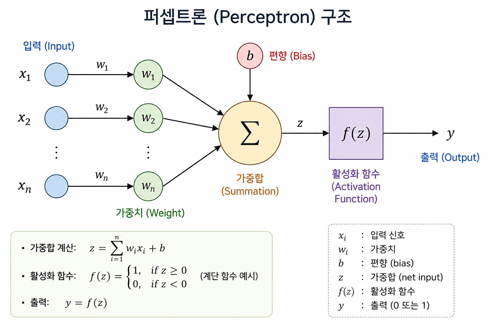

#### 다중퍼셉트론

- [소스](./day07/ex31_pytorch_nn.ipynb)
- 단일 퍼셉트론의 한계를 극복하기 위해 등장. 퍼셉트론을 여러개 쌓아올린 구조
- 입력층, 은닉층, 출력층으로 구분

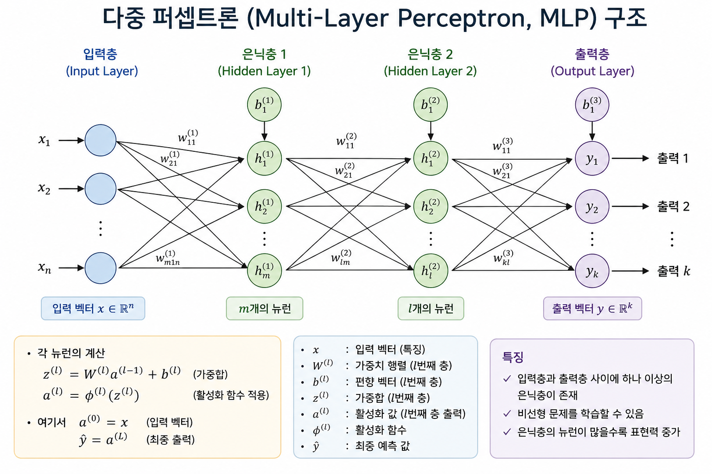

#### 활성화함수
- 출력을 어떻게 변형할지 결정하는 함수
- Sigmoid, Tanh, `ReLU`, Softnas

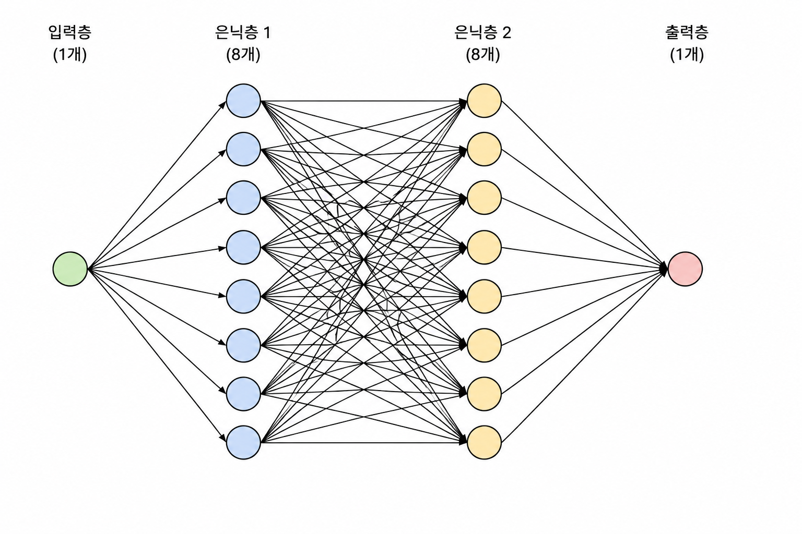

## 9일차

### 딥러닝 실습

#### Fashion-MNIST 분류모델

- MNIST 데이터셋 중 독일 온라인 패션 플랫폼 잘란도에서 공개한 데이터넷
- 6만개의 학습 이미지 1만개 테스트 이미지
- 총 10가지 종류 : 티셔츠, 바지, 풀오버, 드레스, 코트, 샌들, 셔츠, 스니커즈, 가방, 발목부츠
- 28x28 픽셀 흑백이미지 제공

#### CUDA 사용 팁

- 현재 NVIDIA RTX 5060 그래픽카드
    - GPU 아키텍처 - Blakwell계열
    - CUDA Compute Capa - sm_120 사용
    - cuda 12.8 이상 사용
- 이전 버전은 cuda 12.6 사용가능

- 12.6 버전 Pytorch 삭제 후, 13.0 이상 설치
    - 13.2 버전은 전체 Pytorch기능 사용못함

- 설치 방법
```powershell
> .\iot-venv\Scripts\Activate.ps1 # 가상환경 진입

> pip uninstall torch torchvision torchaudio -y

> pip install torch torchvision --index-url https://download.pytorch.org/whl/cu130 
```

#### CNN

- [소스](./day09/ex33_pytorch_cnn.ipynb)
- Convolutional Neural Network(합성곱 신경망) : 이미지나 영상 분석에 특화된 인공지능 신경망 구조
- 로지스틱 회귀 : 이미지를 1차원으로 변경 처리

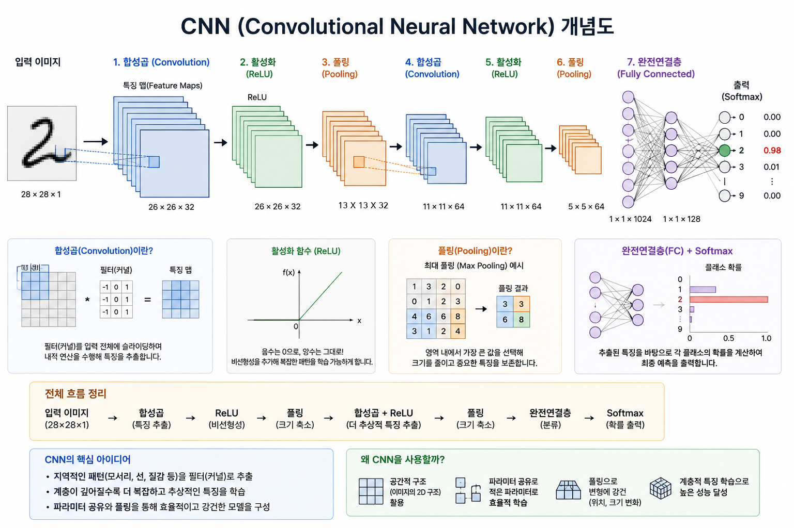
13x26 부분 오타 => 13x13

- 최적화 알고리즘의 softmax() 클래스는 deprecated(추후 버전에 삭제예정)임
    - 최대한 사용을 안하는 것을 추천